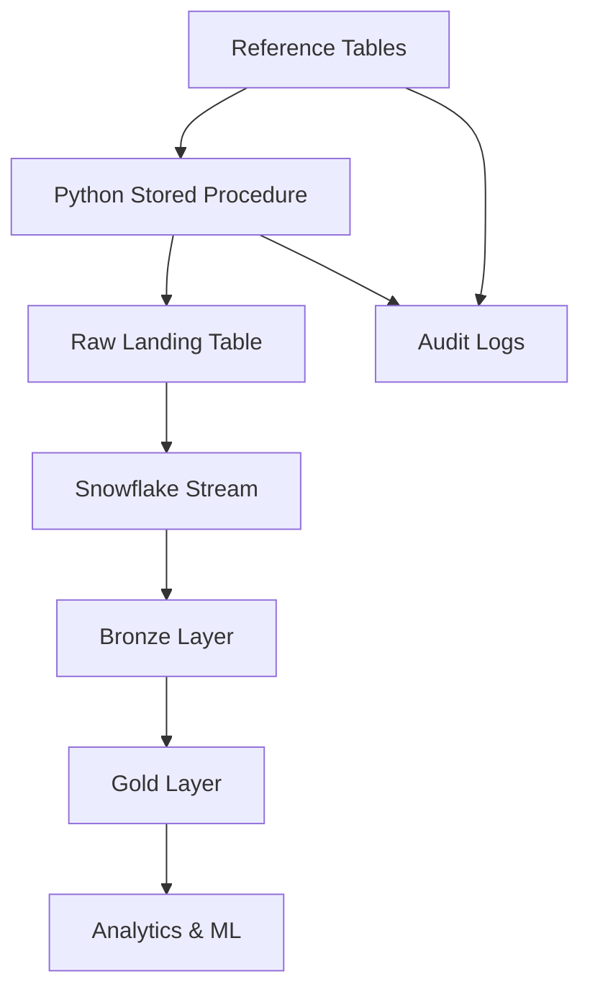

# 🏪 Snowflake Streaming Retail Demo

> **ZERO SETUP COMPLEXITY** - One SQL script creates a complete end-to-end streaming data pipeline in Snowflake with reference-driven configuration and full audit tracking.

## ⚡ 2-Minute Setup

**Complete streaming pipeline in 2 minutes:**

### Option 1: Copy & Paste (Recommended)
1. **Open Snowflake** in your browser
2. **Create new worksheet** 
3. **Copy & paste** the entire `SETUP_SNOWFLAKE.sql` file
4. **Run all** (Ctrl+Shift+Enter or click "Run All")
5. **Start pipeline**: `CALL START_PIPELINE();`

### Option 2: Download & Upload
1. **Download** `SETUP_SNOWFLAKE.sql` from this repo
2. **Upload** to Snowflake worksheet
3. **Execute** the entire script
4. **Start**: `CALL START_PIPELINE();`

```sql
-- Verify everything works
CALL GENERATE_RETAIL_DATA(20, 50);  -- Generate sample data
CALL DATA_SUMMARY();                -- Check all layers
SELECT * FROM GOLD.DIM_CUSTOMERS LIMIT 5;  -- View results
```

**✅ Done!** Your pipeline is now generating data automatically every 30 minutes.

## 🎯 Project Overview

This project demonstrates a **pure Snowflake-native** streaming data pipeline that generates realistic retail data for analytics and machine learning. Everything runs inside Snowflake with zero external dependencies.

### 🏗️ Architecture



**Key Features:**
- 🎯 **Reference-driven configuration** - All parameters in trackable tables
- 📊 **Full audit trail** - Every generation run logged with configuration snapshots
- 🔄 **Consistent customer data** - Same customer always has same attributes
- 🤖 **ML-ready features** - Built-in churn probability, lifetime value
- ⚡ **Pure Snowflake** - No external tools, schedulers, or dependencies

## 📋 What You Need

- Snowflake account with `ACCOUNTADMIN` role
- 2 minutes of your time
- That's it! 

## 🎮 Step-by-Step Setup

### 1. Get the Setup Script
Download or copy the `SETUP_SNOWFLAKE.sql` file from this repository.

### 2. Run in Snowflake
```sql
-- Paste the entire SETUP_SNOWFLAKE.sql content into Snowflake and execute
-- The script will create everything: databases, tables, procedures, tasks
```

### 3. Start Your Pipeline
```sql
-- Start automated data generation (every 30 minutes)
CALL START_PIPELINE();

-- Generate initial data batch
CALL GENERATE_RETAIL_DATA(20, 50);

-- Check your data
CALL DATA_SUMMARY();
```

### 4. Explore Your Data
```sql
-- View customers with ML features
SELECT * FROM GOLD.DIM_CUSTOMERS LIMIT 10;

-- View sales transactions
SELECT * FROM GOLD.FCT_SALES LIMIT 10;

-- Business insights
SELECT 
    customer_segment, 
    COUNT(*) as transactions,
    AVG(final_total) as avg_order_value,
    SUM(final_total) as total_revenue
FROM GOLD.FCT_SALES 
GROUP BY customer_segment;
```

That's it! Your pipeline is now generating data automatically every 30 minutes.

## ⚙️ Configuration & Customization

All data generation parameters are stored in **reference tables** for easy tracking and modification:

```sql
-- View current configuration
CALL VIEW_REFERENCE_CONFIG();

-- Modify customer segment behavior
UPDATE REFERENCE_DATA.CUSTOMER_SEGMENTS 
SET AVG_ORDER_VALUE = 200.0 
WHERE SEGMENT_NAME = 'premium';

-- Change data generation parameters
UPDATE REFERENCE_DATA.GENERATION_PARAMETERS 
SET PARAMETER_VALUE = '0.8' 
WHERE PARAMETER_NAME = 'repeat_customer_probability';

-- Add new product category
INSERT INTO REFERENCE_DATA.PRODUCT_CATEGORIES 
VALUES ('toys_games', '[11, 12]', 0.50, 0.10, 'Toys and games for all ages');
```

### Key Configuration Tables:
- **`CUSTOMER_SEGMENTS`**: Control customer behavior and spending patterns
- **`PRODUCT_CATEGORIES`**: Define seasonal peaks and margins
- **`GENERATION_PARAMETERS`**: Adjust probabilities, ranges, and arrays
- **`MARKETING_CHANNELS`**: Configure marketing performance metrics
- **`WAREHOUSES`**: Set distribution center capabilities

**💡 Pro Tip**: Modify these tables to simulate different business scenarios for testing!

### 📈 Audit & Change Tracking

Every data generation run is automatically audited with full traceability:

```sql
-- View recent generation runs and configuration changes
CALL VIEW_GENERATION_AUDIT(20);

-- Compare reference data between two specific runs  
CALL COMPARE_GENERATION_RUNS('run-id-1', 'run-id-2');

-- View exact configuration used in a specific run
CALL VIEW_RUN_SNAPSHOT('run-id-here', 'ALL');

-- View audit table directly
SELECT * FROM REFERENCE_DATA.DATA_GENERATION_AUDIT 
ORDER BY RUN_TIMESTAMP DESC LIMIT 10;
```

**🔍 Audit Features:**
- **Run ID Tracking** - Every generation gets a unique UUID
- **Configuration Snapshots** - Full reference data captured per run
- **Change Detection** - MD5 checksums detect any configuration changes
- **Performance Metrics** - Execution time and success/failure tracking
- **Historical Comparison** - Compare configurations between any two runs

## 📊 Data Architecture

### Reference Layer (Configuration)
- **`CUSTOMER_SEGMENTS`**: Customer segment definitions and behaviors
- **`PRODUCT_CATEGORIES`**: Product categories with seasonal patterns
- **`MARKETING_CHANNELS`**: Marketing channel performance metrics  
- **`WAREHOUSES`**: Distribution center configuration
- **`GENERATION_PARAMETERS`**: All data generation parameters (controllable)

### Raw Layer (Landing Zone)
- **`RAW_RETAIL_EVENTS`**: JSON events from Python data generator
- **`RAW_RETAIL_EVENTS_STREAM`**: Change data capture stream

### Bronze Layer (Staging)
- **`STG_CUSTOMERS`**: Customer profiles with consistent demographics
- **`STG_PURCHASES`**: Purchase transactions with repeat customer logic

### Gold Layer (Business Ready)
- **`GOLD.DIM_CUSTOMERS`**: Customer dimension with ML features (churn probability, lifetime value)
- **`GOLD.FCT_SALES`**: Sales fact table for financial reporting and analytics

## 🤖 Machine Learning Features

The pipeline generates realistic probabilistic data suitable for ML modeling:

### Customer Analytics
- **Churn Probability**: Based on recency, frequency, monetary patterns
- **Lifetime Value**: Calculated from historical purchase behavior
- **Engagement Scores**: Multi-channel interaction patterns
- **Demographic Consistency**: Same customer always has same age, location, preferences

### Purchase Patterns
- **Seasonal Trends**: Product categories peak during realistic months
- **Customer Segments**: Premium (15%), Regular (60%), Occasional (25%)
- **Repeat Behavior**: 70% existing customers, 30% new acquisitions
- **Price Sensitivity**: Correlated with customer segment and demographics

### ML-Ready Features
- Customer tenure, total orders, average order value
- Geographic and demographic attributes
- Behavioral scores and preferences
- Product affinity and seasonal patterns

## 🔄 Streaming & Automation

### Data Generation Frequency
- **Automated**: Every 30 minutes via Snowflake Tasks
- **Manual**: On-demand via `CALL GENERATE_RETAIL_DATA()`
- **Configurable**: Modify task schedule as needed

### Task Dependencies
```sql
DATA_GENERATION_TASK (every 30 min)
    ↓
BRONZE_TRANSFORMATION_TASK (after generation)
    ↓  
GOLD_TRANSFORMATION_TASK (after bronze)
```

### Pipeline Controls
```sql
-- Start/stop the entire pipeline
CALL START_PIPELINE();
CALL STOP_PIPELINE();

-- Check what's running
CALL CHECK_PIPELINE_STATUS();

-- Generate data manually
CALL GENERATE_RETAIL_DATA(customer_events, purchase_events);
```

## 🛠️ Pipeline Management

### Control Your Pipeline
```sql
-- Start automated generation (every 30 minutes)
CALL START_PIPELINE();

-- Stop all tasks
CALL STOP_PIPELINE();

-- Check pipeline status
CALL CHECK_PIPELINE_STATUS();

-- View data across all layers
CALL DATA_SUMMARY();

-- View configuration and audit trail
CALL VIEW_REFERENCE_CONFIG();
CALL VIEW_GENERATION_AUDIT();
```

### Customizing Data Generation
```sql
-- Generate specific event volumes
CALL GENERATE_RETAIL_DATA(
    customer_events => 50,
    purchase_events => 100,
    marketing_events => 20,
    supply_chain_events => 10
);

-- Modify behavior via reference tables
UPDATE REFERENCE_DATA.CUSTOMER_SEGMENTS 
SET PURCHASE_FREQUENCY = 0.5 
WHERE SEGMENT_NAME = 'premium';
```

## 📈 Business Use Cases

### Customer Analytics Team
- Churn prediction models using engagement scores
- Customer lifetime value optimization
- Segmentation analysis with demographic consistency
- Behavioral pattern recognition

### Marketing Team  
- Campaign performance tracking across channels
- Customer acquisition cost analysis
- Seasonal trend identification
- A/B testing framework with consistent customer pools

### Finance Team
- Revenue forecasting with realistic seasonality
- Customer profitability analysis
- Pricing optimization models
- Financial reporting automation

## 🔧 Advanced Configuration

### Reference Data Management
All configuration is stored in reference tables for full traceability:

```sql
-- View all current configuration
CALL VIEW_REFERENCE_CONFIG();

-- Modify customer behavior
UPDATE REFERENCE_DATA.CUSTOMER_SEGMENTS 
SET AVG_ORDER_VALUE = 300.0, PURCHASE_FREQUENCY = 0.4
WHERE SEGMENT_NAME = 'premium';

-- Add new product category
INSERT INTO REFERENCE_DATA.PRODUCT_CATEGORIES 
VALUES ('luxury_goods', '[11, 12]', 0.70, 0.02, 'High-end luxury products');

-- Adjust generation parameters
UPDATE REFERENCE_DATA.GENERATION_PARAMETERS 
SET PARAMETER_VALUE = '0.85' 
WHERE PARAMETER_NAME = 'repeat_customer_probability';
```

## 🔍 Monitoring & Observability

### Generation Audit Trail
```sql
-- View recent generation runs with change detection
CALL VIEW_GENERATION_AUDIT(20);

-- Compare configurations between two runs
CALL COMPARE_GENERATION_RUNS('run-id-1', 'run-id-2');

-- View exact configuration used in a specific run
CALL VIEW_RUN_SNAPSHOT('run-id-here');

-- Check data freshness
SELECT MAX(CREATED_AT) as last_update 
FROM RAW_DATA.RAW_RETAIL_EVENTS;
```

### Performance Monitoring
```sql
-- Check pipeline status
CALL CHECK_PIPELINE_STATUS();

-- View data summary across all layers
CALL DATA_SUMMARY();

-- Monitor task execution history
SELECT * FROM TABLE(INFORMATION_SCHEMA.TASK_HISTORY()) 
WHERE NAME LIKE '%RETAIL%' 
ORDER BY SCHEDULED_TIME DESC LIMIT 10;
```

## 🚨 Troubleshooting

### Common Issues

**Pipeline not generating data**
```sql
-- Check if tasks are running
CALL CHECK_PIPELINE_STATUS();

-- Start pipeline if suspended
CALL START_PIPELINE();

-- Generate data manually
CALL GENERATE_RETAIL_DATA(20, 50);
```

**No data in Gold layer**
```sql
-- Check if stream has data
SELECT SYSTEM$STREAM_HAS_DATA('RAW_RETAIL_EVENTS_STREAM');

-- Run transformations manually
CALL TRANSFORM_BRONZE_TO_GOLD();

-- Check for errors in task history
SELECT * FROM TABLE(INFORMATION_SCHEMA.TASK_HISTORY()) 
WHERE STATE = 'FAILED' ORDER BY SCHEDULED_TIME DESC;
```

**Configuration changes not taking effect**
```sql
-- Verify changes were saved
CALL VIEW_REFERENCE_CONFIG();

-- Check audit trail for configuration changes
CALL VIEW_GENERATION_AUDIT(5);

-- Generate new data to pick up changes
CALL GENERATE_RETAIL_DATA(10, 25);
```

### Getting Help

1. **Check audit logs**: `CALL VIEW_GENERATION_AUDIT()` shows run history and errors
2. **Validate configuration**: `CALL VIEW_REFERENCE_CONFIG()` shows current settings
3. **Test generation**: `CALL GENERATE_RETAIL_DATA(5, 10)` for quick testing
4. **Monitor tasks**: `CALL CHECK_PIPELINE_STATUS()` shows task states

## 📁 Project Structure

```
📦 snowflake_demo_streaming_e2e/
├── 🚀 SETUP_SNOWFLAKE.sql        # Complete pipeline in one file
├── 📚 README.md                  # Complete guide (setup + documentation)
└── 📄 LICENSE                   # MIT License
```

### Pure Single-File Architecture

This project follows a **radical simplicity** approach:

**✅ What you need:**
- `SETUP_SNOWFLAKE.sql` - The entire streaming pipeline in one file

**✅ What's included:**
- Python data generator (embedded as stored procedure)
- Reference tables with all configuration
- Bronze and Gold layer transformations  
- Task orchestration and scheduling
- Complete audit trail system
- All database objects and procedures

**✅ What's NOT needed:**
- External Python files or dependencies
- dbt or other transformation tools
- External schedulers or orchestrators
- Configuration files or environment setup

**🎯 To modify the system:**
1. Edit the Python code directly in `SETUP_SNOWFLAKE.sql` (lines ~300-950)
2. Modify reference tables via SQL for configuration changes
3. The SQL file is the single source of truth

## 🎯 Key Features Summary

✅ **Zero External Dependencies** - Pure Snowflake solution  
✅ **Reference-Driven Configuration** - All parameters in trackable tables  
✅ **Full Audit Trail** - Every generation run logged with configuration snapshots  
✅ **Consistent Customer Data** - Same customer always has same attributes  
✅ **Realistic Behavior Patterns** - 70% repeat customers, seasonal trends  
✅ **ML-Ready Features** - Churn probability, lifetime value, behavioral scores  
✅ **Automated Pipeline** - Data generation every 30 minutes  
✅ **Bronze → Gold Architecture** - Streamlined 2-layer approach  
✅ **One-Click Setup** - Run one SQL script and you're done  
✅ **Change Tracking** - MD5 checksums detect configuration changes  

**📧 Questions?** The 2-minute setup is right at the top of this README - just copy, paste, and run!
